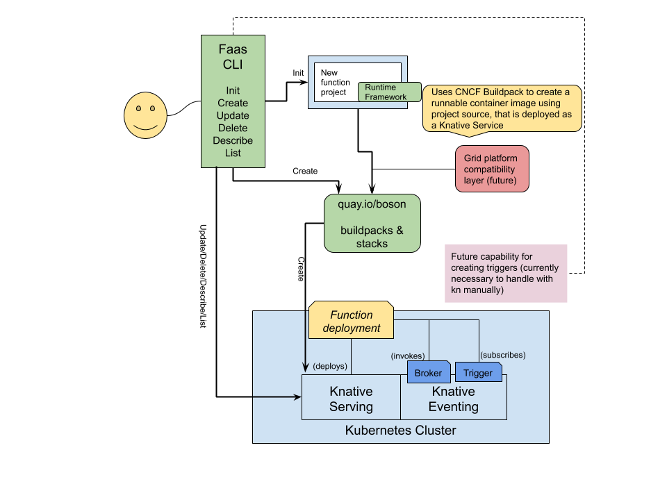

# Boson Project FAQ
Frequently asked questions about Boson Project

## What is Boson Project?
Boson Project is a collection of tooling that enables developers to create and
run functions as a Knative Service on Kubernetes. The major components of this
project are listed here.

* Function runtimes for Go, Node.js and Quarkus
* Buildpacks for Go, Node.js and Quarkus
* A `faas` CLI for initializing, creating and deploying functions as a Knative Service
* Knative Serving and Eventing as the platform on which it all runs



## How mature is the Boson Project?
Boson started out as a proof of concept project in mid 2020 and is currently under
active development. However, there are as yet no "official" releases of any tooling
other than Knative Serving and Eventing, which is separate and distinct from Boson.

## What is the difference between Boson and OpenWhisk?
While Boson is explicitly built for the Knative platform, OpenWhisk is a different
beast entirely. It is not possible to run Boson Functions on OpenWhisk nor is it
possible to run OpenWhisk functions on Boson.

## How are Boson Functions invoked?
Boson Functions are deployed as Knative Services, so they are invoked by simple
HTTP requests. These HTTP requests may be sent directly from external sources
via Kubernetes ingress, or they may be invoked from within the cluster by the
Knative Event Broker. All function runtimes currently expose a raw HTTP invocation
capability as well as a `CloudEvent` invocation signature.

## How do Boson Functions subscribe to events?
Events in the Knative platform are exposed to Boson Functions via Knative
`Triggers`. A function project expresses its interest in events of a specific
type or from a specific source via a `Trigger`. Subsequently, the Knative
event Broker will route these events to a function, invoking it with an HTTP
POST request comprised of a `CloudEvent`.

## What does a Boson Function look like?
Boson Functions are simply that - functions. They are written in either Go,
Node.js or Java/Quarkus. The Boson `faas` CLI can create a Boson Function
project using a [template](https://github.com/boson-project/faas/tree/develop/templates)
which provides the overall structure for your function. Here is a simple example
function, written in Node.js.

```js
module.exports = async function (context) {
  if (!context.cloudevent) {
    return Promise.reject(new Error('No cloud event received'));
  }
  context.log.info(`Cloud event received: ${JSON.stringify(context.cloudevent)}`);
  return new Promise((resolve, reject) => {
    setTimeout(_ => resolve({ data: context.cloudevent.data }), 500);
  });
};
```

Note that the function is `async` and returns a `Promise`, however, this is not required.
This function is from the default template used when creating a Node.js project using
the `faas` CLI and is expected to be invoked with a `CloudEvent`. To access the raw HTTP
request, there are properties on the `context` object that is provided. For example,

```js
function invoke(context) {
  context.log.info(`Handling HTTP ${context.httpVersion} request`);
  if (context.method === 'POST') {
    return handlePost(context);
  } else if (context.method === 'GET') {
    return handleGet(context);
  } else {
    return { statusCode: 451, statusMessage: 'Unavailable for Legal Reasons' };
  }
}

function handlePost(context) {
  return {
    body: context.body,
    name: context.body.name
  }
};

function handleGet(context) {
  return {
    query: context.query,
    name: context.query.name,
  }
};
```

As you can see from this example, a Boson Function project may contain more than
a single function. Only the exported function will be invoked.

## Can I run my functions on OpenShift?
The Boson Project is designed to work well both on OpenShift with the Serverless
Operator installed, or vanilla Kubernetes with Knative.

## How can I get started using Boson Functions?
Boson Functions are still under active development.

TODO: Describe how to hack your way through the jungle

## When will Boson Project be ready for general usage?
There is not a fixed date at the moment for Boson Function availability, however
we are hoping to provide a Developer Preview in late summer/early fall.

## Who is behind Boson Project?
Boson Functions are a project from Red Hat.