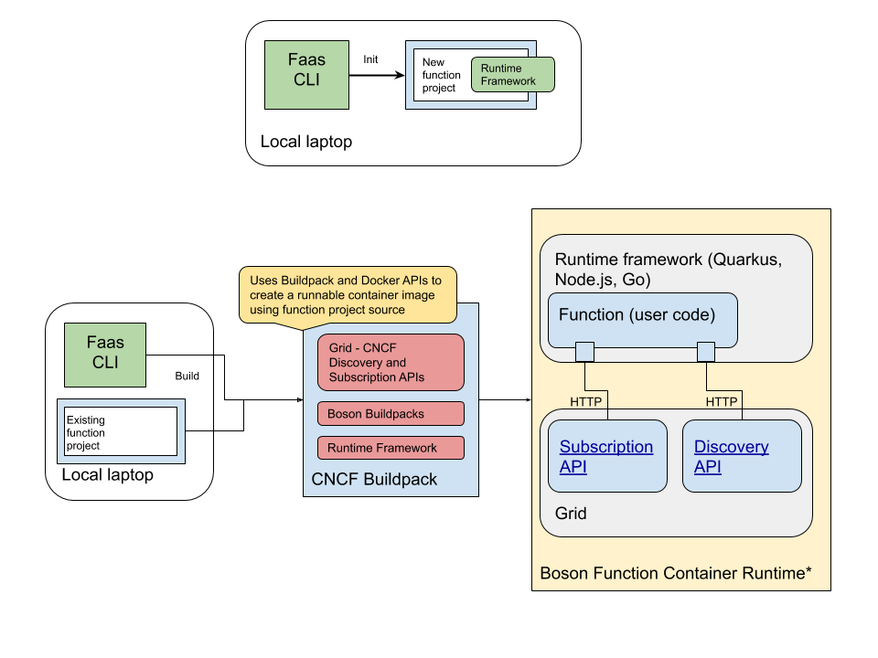
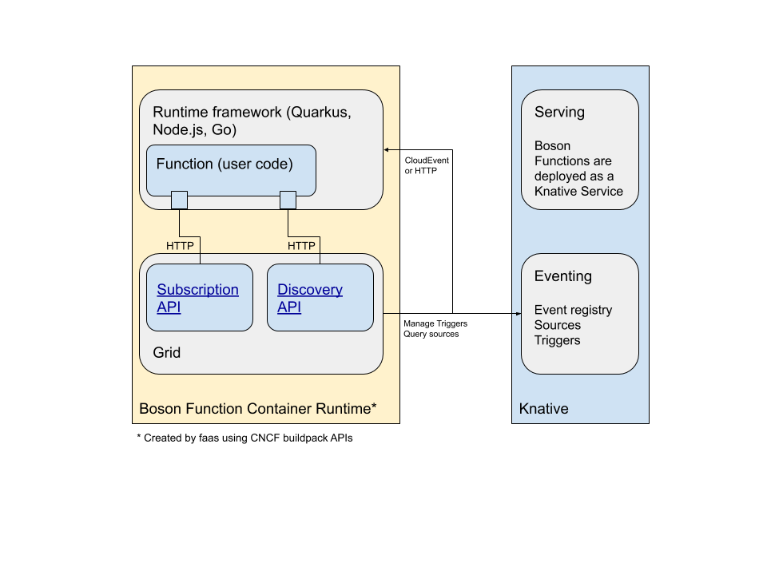

# Boson Project FAQ
Frequently asked questions about Boson Project.

## What is Boson Project?
Boson Project is a collection of tooling that enables developers to create and
run functions as a Knative Service on Kubernetes. The major components of this
project are listed here.

* Function runtimes for Go, Node.js and Quarkus
* Buildpacks for Go, Node.js and Quarkus
* A `faas` CLI for initializing, creating and deploying functions as a Knative Service
* Knative Serving and Eventing as the platform on which it all runs

## How mature is the Boson Project?
Boson started out as a proof of concept project in mid 2020 and is currently under
active development. We anticipate a limited Developer Preview in late fall 2020.

## Tooling and Architecture

The primary tooling used by a function developer is the
[`faas` CLI](https://github.com/boson-project/faas). Developers use this CLI to create
new function projects and deploy them to a Kubernetes cluster running Knative Serving
and Eventing. During deployment, the developer's function code is combined with a runtime
framework (for example Quarkus or Node.js) and a platform proxy API
(aka [`grid`](https://github.com/boson-project/grid)) using the CNCF Buildpack APIs to
create a runnable OCI container.

## Using Boson Functions

For Function projects, a developer uses the `faas` CLI for project creation and
deployment. To get started using Boson Functions now, please follow the
[step by step tutorial](tutorial.md).

### Function Builds

The `faas` CLI uses the CNCF Buildpack API to create a container image. The
[buildpacks](https://github.com/boson-project/buildpacks/)
are based on and extend Red Hat UBI 8 and UBI 8 Minimal images.



### Function Deployments

Once a container image has been created, the CLI can deploy it as a Knative service
on the cluster currently active in `~/.kube/config`.

Future development will also have a second process running in the image. This is the
Boson `grid`. This service, has REST endpoints for platform-agnostic
[Subscription](https://github.com/cloudevents/spec/blob/master/subscriptions-api.md) and
[Discovery](https://github.com/cloudevents/spec/blob/master/discovery.md) APIs, allowing
the function to subscribe to event sources upon startup.



## How are Boson Functions invoked?
Boson Functions are deployed as Knative Services, so they are invoked by simple
HTTP requests. These HTTP requests may be sent directly from external sources
via Kubernetes ingress, or they may be invoked from within the cluster by the
Knative Event Broker. All function runtimes currently expose a raw HTTP invocation
capability as well as a `CloudEvent` invocation signature.

## How do Boson Functions subscribe to events?
Events in the Knative platform are exposed to Boson Functions via Knative
`Triggers`. A function project expresses its interest in events of a specific
type or from a specific source via a `Trigger`. Subsequently, the Knative
event Broker will route these events to a function, invoking it with an HTTP
POST request comprised of a `CloudEvent`.

## What does a Boson Function look like?
Boson Functions are simply that - functions. They are written in either Go,
Node.js or Java/Quarkus. The Boson `faas` CLI can create a Boson Function
project using a [template](https://github.com/boson-project/faas/tree/develop/templates)
which provides the overall structure for your function. Here is a simple example
function, written in Node.js.

```js
module.exports = async function (context) {
  if (!context.cloudevent) {
    return Promise.reject(new Error('No cloud event received'));
  }
  context.log.info(`Cloud event received: ${JSON.stringify(context.cloudevent)}`);
  return new Promise((resolve, reject) => {
    setTimeout(_ => resolve({ data: context.cloudevent.data }), 500);
  });
};
```

This function is from the default template used when creating a Node.js project using
the `faas` CLI and is expected to be invoked with a `CloudEvent`. To access the raw HTTP
request, there are properties on the `context` object that is provided. For example,

```js
function invoke(context) {
  context.log.info(`Handling HTTP ${context.httpVersion} request`);
  if (context.method === 'POST') {
    return handlePost(context);
  } else if (context.method === 'GET') {
    return handleGet(context);
  } else {
    return { statusCode: 451, statusMessage: 'Unavailable for Legal Reasons' };
  }
}

function handlePost(context) {
  return {
    body: context.body,
    name: context.body.name
  }
};

function handleGet(context) {
  return {
    query: context.query,
    name: context.query.name,
  }
};
```

A Boson Function project may contain more than a single function. Howver, only the
function exported from `index.js` will be invoked.

### Other Examples

<details>
<summary>Quarkus Example</summary>
  
  ```java
  package com.example;
  
  public class Functions {
    // To expose the function just add `@Funq` annotation.
    // The input/output type should be either primitive type or Java Bean.
    @Funq
    public String toLowerCase(String val) {
        return val.toLowerCase();
    }
  }
  ```
  
</details>

<details>
<summary>Go Raw HTTP Example</summary>
  
  ```go
  package function

  import (
    "context"
    "fmt"
    "net/http"
    "os"
  )

  // The function has to be named `Handle` and it has to be in the`function` package.
  // Handle an HTTP Request.
  // The `ctx` param is optional.
  func Handle(ctx context.Context, res http.ResponseWriter, req *http.Request) {

    res.Header().Add("Content-Type", "text/plain")
    res.Header().Add("Content-Length", "3")
    res.WriteHeader(200)

    _, err := fmt.Fprintf(res, "OK\n")
    if err != nil {
      fmt.Fprintf(os.Stderr, "error or response write: %v", err)
    }
  }
  ```
  
</details>

<details>
<summary>Go CloudEvent Example</summary>
  
  ```go
  package function

  import (
    "context"
    "fmt"
    "os"

    cloudevents "github.com/cloudevents/sdk-go/v2"
  )

  // The function has to be named `Handle` and it has to be in the`function` package.
  // Handle a CloudEvent.
  // Valid fn signatures are:
  // * func()
  // * func() error
  // * func(context.Context)
  // * func(context.Context) protocol.Result
  // * func(event.Event)
  // * func(event.Event) protocol.Result
  // * func(context.Context, event.Event)
  // * func(context.Context, event.Event) protocol.Result
  // * func(event.Event) *event.Event
  // * func(event.Event) (*event.Event, protocol.Result)
  // * func(context.Context, event.Event) *event.Event
  // * func(context.Context, event.Event) (*event.Event, protocol.Result)
  func Handle(ctx context.Context, event cloudevents.Event) error {
    if err := event.Validate(); err != nil {
      fmt.Fprintf(os.Stderr, "invalid event received. %v", err)
      return err
    }
    fmt.Printf("%v\n", event)
    return nil
  }
  ```
  
</details>

## Can I run my functions on OpenShift?
The Boson Project is designed to work both on OpenShift with the Serverless
Operator installed, or Kubernetes with Knative.

## Provisioning a Cluster
If you don't already have an OpenShift instance with Serverless installed, or a
Kubernetes cluster with Knative Serving and Eventing, you can follow our
[Getting Started with Kubernetes Guide](https://github.com/boson-project/faas/blob/develop/docs/getting_started_kubernetes.md) to provision a cluster for function deployment.
Or follow our instructions for setting up a [kind cluster]('kind-setup.md') on
your local system.

## When will Boson Project be ready for general usage?
There is not a fixed date at the moment for Boson Function availability, however
we are hoping to provide a Developer Preview in the fall of 2020.

## How does this project relate to Knative ?
Knative can be used as a target deployment for these functions

## What are the application types and use cases/user stories for Boson Functions?
There are varieties of application types and user stories that could be acheived using Functions.
Even Driven is the pattern that is at heart of the Functions and any Event Driven architecture could benefit from it.
Some examples are:
  - E-Commerce website:
     - Function for Authentication that could show a personalized page.
     - Function for cart management
     - Function for payment management
     - Function for Recommendation
     - Cashless Payment System

  - Media File Processing:
    - Change the format of Files
    - Generating thumbnails version of images
    - Uploading thumbnails version of images to profile/dashboard

  - Data Transformation
    - Adding metadata to existing data
    - Combining data from another source
    - Converting the format of the data
    - Restructuring the data
    - Normalization of the data

 - Scheduled Jobs
 - ChatBot
 - IoT backend
 - notification based.
 - Automation Tasks
    - Content Creator
 - Machine Learning data analytics
 - Stream processing

## Would I be able to write Stateful functions?
Currently Boson Functions only offer Stateless functions but we would be adding Stateful Functions in the near future.

## What languages/framework can I use to write my functions?
Boson Functions provide buildpacks for Quarkus, Node.js and Go for now with plans for Python, Spring Boot, Rust in the near future.

## What events can trigger/call these functions?
Boson Functions offers support for HTTP event and [cloudevents](https://cloudevents.io/). 

## Who is behind Boson Project?
Boson Project are project from Red Hat that creates Functions based on Knative.


//TODO

## Does functions built using boson-project on any Kubernetes ? 
## What restrictions would apply to the functions code?
## How can I do logging in these distributed functions?
## Would I be able to share code across my functions?
## How would I monitor these functions?
## How will I manage these functions?
## Would I be able to access the infrastructure where these functions would run?
## How would these functions secure my code?
## Would I be able to use threads in these functions?
## What are the best practices for working with Functions?
## How does this project relate to KEDA ?
## Can I build functions using this project and run on Azure Platform?
## Can I build functions using this project and run on AWS?
## How different this project is from Azure Functions?
## How different this project is from AWS Lambda?

